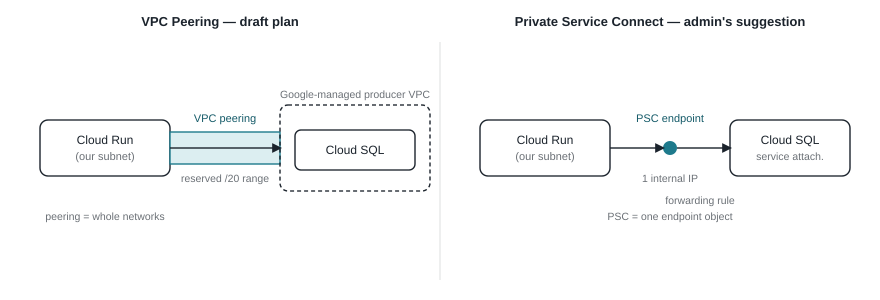
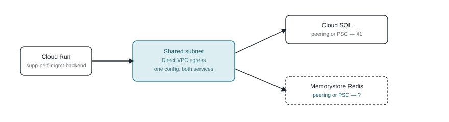
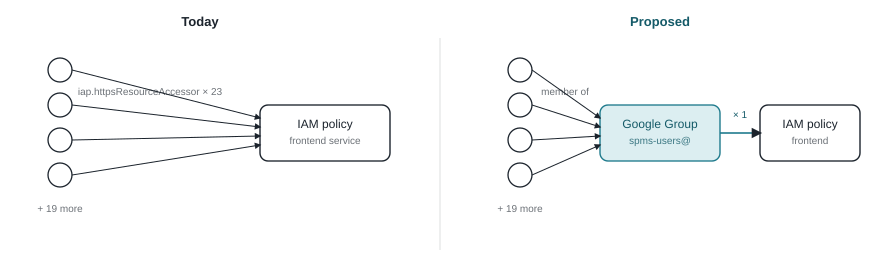

# SPMS Infrastructure Brief

Reference copy of the brief prepared for the 2026-09-11 GCP architect review.
The interactive, theme-adaptive version is published at:
https://claude.ai/code/artifact/368d1adf-ecfd-4c48-9222-339d3ef43b85 — the
diagrams below are fixed light-theme snapshots, regenerated by hand if the
artifact is ever redrawn.

Four open infrastructure decisions, each needing a call before they become
formal requests to the GCP admins.

## Agenda

1. **Cloud SQL connectivity** — Private Service Connect, or the VPC-peering
   plan already drafted?
2. **Redis connectivity** — same mechanism as Cloud SQL, or does it need its
   own answer?
3. **Frontend IAP access** — move from 23 individual grants to one Google
   Group?
4. **BigQuery load time** — is the Sheets-vs-scheduled-load ingestion
   question in scope now?

---

## 1. Cloud SQL for PostgreSQL — connectivity method

Cloud SQL has to be private-IP-only in this project
(`sql.restrictPublicIp` blocks public IP outright). The draft plan reaches it
over classic VPC peering. The GCP admin who reviewed the request suggested
Private Service Connect (PSC) instead. Both need a VPC, a subnet, and Direct
VPC egress from Cloud Run either way — what differs is only how the last hop
into Cloud SQL is made.

Both sides still need Cloud Run's Direct VPC egress into our subnet (not
pictured on either side, since it's identical either way). What differs is
the last hop: peering ties our whole VPC to Google's producer network via a
reserved range; PSC is a single internal IP with a forwarding rule, no
network-level relationship at all.

| | VPC Peering (draft plan) | Private Service Connect |
|---|---|---|
| Reserved range | Yes — a /20 per environment, must not collide with any future corporate network bridge | None — one IP from the subnet already being created |
| Network relationship | Peering between our VPC and Google's producer network (non-transitive, capped in count) — a real topology limit if this ever needs to scale to more consumers | None — point-to-point endpoint, no peering object at all |
| VPC / subnet / egress | Identical either way — both need it | Identical either way — both need it |
| Setup steps (new) | Reserve range → connect peering | Enable PSC on instance → reserve 1 IP → create forwarding rule |
| Verified live? | No — written up, not yet run | No — flag names unconfirmed against current `gcloud` |
| Google's direction | Older mechanism, still fully supported | Newer, generally preferred for new setups |

**Decision needed:** adopt PSC for Cloud SQL, or proceed with the peering
plan already written up? Neither is blocked — this is a "better vs. good
enough" call, not a fix for something broken.

---

## 2. Memorystore for Redis — same question, one layer over

Redis is for caching (see §4) and needs the same private-network access as
Cloud SQL: always private IP by design, no public option to begin with. It
reuses the exact same VPC and Direct VPC egress already being set up for
Cloud SQL — nothing extra on the Cloud Run side. The open question is
narrower here: which connectivity mechanism, and was the admin's PSC
suggestion meant to cover Redis too, or Cloud SQL specifically?

The subnet and egress config are shared and settled either way. Only the
last-hop mechanism into each managed service is still open — and it doesn't
have to be the same answer for both.

| | VPC Peering | Private Service Connect |
|---|---|---|
| Public IP option | None either way — Memorystore has no public IP at all, by design | None either way — Memorystore has no public IP at all, by design |
| Maturity for Redis | The long-standing default for classic Memorystore tiers | Newer for Redis specifically — worth the admin confirming current tier support before committing |
| Shares infra with Cloud SQL? | Same VPC/subnet/egress regardless of which mechanism each service uses | Same VPC/subnet/egress regardless of which mechanism each service uses |

**Decision needed:** should Redis follow whatever's decided for Cloud SQL in
§1, or does it need its own answer — e.g. peering for Redis even if Cloud
SQL moves to PSC?

---

## 3. Frontend IAP access — 23 individual grants, or one group

Today, frontend access is granted one person at a time — 23 separate
`IAP-secured Web App User` principals on the IAM policy. Every new hire or
offboarding is a direct IAM edit. The proposal: grant the role once to a
Google Group, and manage access by editing group membership instead.

The IAM policy holds one grant either way it's read — the difference is
where membership lives. Today it lives on the IAM policy itself (23 rows);
proposed, it lives in the group (one IAM row, membership managed
separately).

| | Individual grants (today) | Google Group (proposed) |
|---|---|---|
| Add a user | New IAM binding on the Cloud Run/IAP policy | Add to group membership — no IAM change |
| Remove a user | Find and delete their specific binding | Remove from group — access revoked immediately |
| Who can do it | Whoever has IAM edit rights on the project | Whoever manages the group — can be delegated separately from GCP IAM |
| Audit | 23 rows to review individually | One IAM row; membership audited in Workspace |
| Setup cost | None — already how it's done | One-time: create/designate the group, one IAM binding swap |

**Decision needed:** is there an existing Whirlpool group to reuse, or does a
new one get created — and who owns that, Workspace admin or GCP admin?

---

## 4. BigQuery dashboard load time — four levers, one owner each

Only 2 of the ~15 dashboard KPI sections currently query BigQuery at all
(Exhibits, Risk Rating Components); the rest are still fixture data with no
I/O. For those two, every optimization below sits at a different point on
the same request path — most are ours to fix directly.

Four levers, four different owners: caching and query design are backend
code changes; the cold-start fix is a Cloud Run flag we can set ourselves;
only the Sheets-vs-scheduled-load ingestion method (bottom) is the open
question in our spec (`BE-A-DR1`) that plausibly needs GCP/data-admin
involvement.

| Lever | Owner | Needs a GCP request? | Status |
|---|---|---|---|
| Query design | Backend dev — narrow the `SELECT`, push filtering into SQL | No | Not started |
| Caching | Backend dev, once Redis exists (§2) | No — Redis provisioning already requested separately | Blocked on §2 |
| Cold starts | Backend dev — `gcloud run services update --min-instances=1` | No — `run.services.update` already confirmed held | Not started |
| Ingestion method | Data/GCP admin — resolve open spec question `BE-A-DR1` | **Yes** — the one real ask here | Undecided |

**Decision needed:** should resolving `BE-A-DR1` (Sheets external tables vs.
a scheduled load into native BigQuery tables) be scoped as its own piece of
work, or folded into this round of requests?
