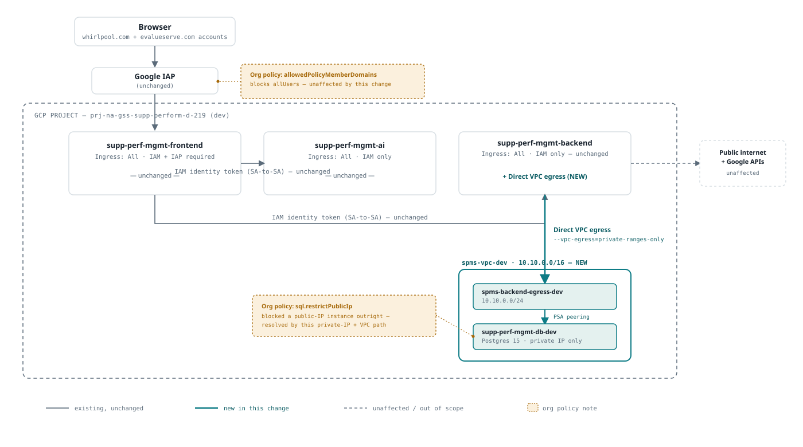

# VPC + Cloud SQL for `supp-perf-mgmt-backend` — implementation runbook

**Scope, deliberately narrow:** this covers *only* Direct VPC egress on
`supp-perf-mgmt-backend` so it can reach a private-IP Cloud SQL instance
(`docs/cloudsql-postgres-setup.md`). It does **not** touch ingress, IAP, or
IAM invoker bindings on any service — `supp-perf-mgmt-frontend`,
`supp-perf-mgmt-ai`, and the `frontend-chat` test service are untouched by
everything below. If "implement VPC for the project" (SPM-208) ever expands
to mean locking down ingress project-wide, that is a separate piece of work
— see the ingress-lockdown discussion already had in chat/session memory,
not repeated here.

Nothing in this doc has been run yet. It's the checklist to work through
before touching the real dev project, in order.



*Static export of the interactive version:
https://claude.ai/code/artifact/7b860cca-914d-432a-9a96-df0cc7ac5de7 — that
one adapts to light/dark theme; this file is a fixed light-theme snapshot,
regenerated by hand if the diagram is ever redrawn.*

## 0. Why this is one-time infra + a permanent pipeline change, not a one-off command

Two different things are being set up here, and they have different
lifecycles:

- **The infra itself** (VPC, subnet, private-services peering, the Cloud SQL
  instance) — created **once** per environment. It sits there independently
  of any deploy.
- **The Cloud Run service's attachment to that infra** (`--network`,
  `--subnet`, `--vpc-egress` on `gcloud run deploy`) — this is revision
  config, and Cloud Run has no memory of it between deploys. Every
  `gcloud run deploy` builds a brand-new revision from only the flags given
  *that* call. Bitbucket's `deploy_cloud_run` step already runs on every push
  to `dev`/`qa`/`main` — so these three flags have to be baked into that
  step's `gcloud run deploy` call permanently (see §5), not run by hand once.
  A manual `gcloud run services update --network=... ` from Cloud Shell would
  work right up until the next pipeline deploy overwrites it with a revision
  that doesn't have it.

## 0.5. Alternative considered and rejected: Postgres running as its own Cloud Run service

Raised in session: instead of Cloud SQL, run Postgres itself in a container
on Cloud Run, to avoid the VPC work below entirely. Rejected — it doesn't
actually avoid the VPC work, and introduces a real risk of data loss:

- Cloud Run has no attached persistent disk. The only writable-volume
  option besides ephemeral `tmpfs` is a Cloud Storage bucket via GCS FUSE,
  which does not provide the POSIX semantics (byte-range locking, atomic
  rename, real `fsync`) Postgres depends on for its data directory — a
  documented data-corruption risk, not a theoretical one.
- Cloud Run instances are not singletons — the platform scales instance
  count with traffic and can recycle any instance at any time. A database
  needs exactly one process holding its data files; nothing in Cloud Run
  guarantees that, opening the door to split-brain writes or a mid-write
  kill.
- It still wouldn't remove the VPC-shaped work — service-to-service privacy
  is easy without a VPC either way, but durability/backup/failover
  (the actual reason to run a real database) isn't solved by this, just
  reinvented badly.

If the goal is specifically to avoid the VPC lift below, the one option
that genuinely does that while staying policy-compliant is Firestore
(`constraints/sql.restrictPublicIp` never applies — it's a Google API, not
a network-addressable instance). That was already weighed against Cloud SQL
and passed over for relational/join/reporting needs — worth reopening
explicitly if that trade-off looks different now, rather than treating
Postgres-on-Cloud-Run as a middle ground. It isn't one.

## 0.6. Revision (2026-09-09): Cloud SQL private connectivity via Private Service Connect, not peering

GCP admin feedback on the request email: use Private Service Connect (PSC)
for Cloud SQL instead of the VPC-peering-based Private Services Access (PSA)
approach §3 originally had. Adopting this — it's Google's newer, generally
preferred path for this exact case, and drops two real downsides of peering:

- No shared global CIDR range to reserve and hand to Google's producer
  network — the PSA range step disappears for Cloud SQL, one less thing
  weighed against the "don't collide with the wider corporate network"
  caveat in §1.
- No VPC peering relationship at all (peering is non-transitive and capped
  in count) — a PSC endpoint is just one internal IP + forwarding rule,
  entirely inside our own subnet.

**What doesn't change:** the VPC, the subnet, and Cloud Run's Direct VPC
egress into it (§3/§5) are still required either way. PSC replaces only
Cloud SQL's own private-services-access peering, not the VPC lift itself —
don't read this as "no VPC needed after all."

**Scope: Cloud SQL only.** The Memorystore/Redis plan (sent in the same
email, not yet written into this doc) still assumes the older peering-based
private connectivity — classic Memorystore tiers don't have the same PSC
story as Cloud SQL. Ask the admin directly whether PSC is meant to extend to
Redis too rather than assuming it does.

**Caveat on §3 below:** unlike the `sql.restrictPublicIp` failure earlier in
this doc, the PSC commands haven't been run against the real project — there's
no live result confirming exact flag spelling on the current `gcloud`
version. Verify against `gcloud sql instances create --help`, or have the
admin who suggested this confirm, before running §3.

## 1. CIDR plan — reserved now for dev/qa/prod; all three projects already exist

**Correction (2026-09-08):** this section previously said qa/prod projects
"don't exist yet." Confirmed wrong via the GCP project switcher — all three
projects are already provisioned: dev (`prj-na-gss-supp-perform-d-219`), qa
(`prj-na-gss-supp-perform-q-373`, also referenced in
[[spms-qa-pipeline-status]] for the backend's QA pipeline), and prod
(`prj-na-gss-supp-perform-p-443`). What's actually true is narrower than the
old wording claimed: only **dev** has the VPC + Cloud SQL infra *built* so
far (this doc). The project shells existing doesn't mean the network/instance
work below has been repeated there, and it doesn't mean this identity's IAM
permissions in qa/prod match what §2 found in dev — that check needs
re-running per-project, not assumed to carry over.

Each environment is its own GCP project. A collision *within* one project
isn't possible across separate projects regardless, but picking
non-overlapping ranges now costs nothing and avoids ever having to re-IP
something later if these projects are ever connected (Shared VPC, VPC
Peering, an on-prem Interconnect/VPN) — none of that exists today as far as
anything checked in this repo shows, but ranges are cheap to reserve and
expensive to redo.

| Environment | Project | Region | Direct VPC egress subnet | Private Services Access range |
|---|---|---|---|---|
| dev | `prj-na-gss-supp-perform-d-219` | us-east4 | `10.10.0.0/24` | `10.10.16.0/20` |
| qa | `prj-na-gss-supp-perform-q-373` | us-east4 | `10.20.0.0/24` | `10.20.16.0/20` |
| prod | `prj-na-gss-supp-perform-p-443` | us-east4 | `10.30.0.0/24` | `10.30.16.0/20` |

- The `/24` subnet is what the Cloud Run revision's Direct VPC egress
  attaches to — Google's own guidance is a `/26` minimum for headroom per
  revision; `/24` leaves room to add more Cloud Run services onto the same
  subnet later without re-planning.
- The `/20` was reserved for Google-managed private-services peering — under
  §0.6's PSC revision, Cloud SQL no longer uses it (a PSC endpoint takes one
  IP from the `/24` subnet instead). Left reserved rather than clawed back:
  cheap to hold, and it's still there if Redis's still-peering-based plan
  ends up wanting it instead of the separate range proposed for it.
- **Caveat:** this only guarantees non-overlap *among these three
  environments' own ranges*, chosen from RFC1918 space that nothing in this
  project currently uses (confirmed: `VPC: None` on every Cloud Run service
  today). It is not a claim about the wider Whirlpool network — if these
  projects are ever bridged to a corporate network, whoever owns that IP
  plan should confirm these ranges don't collide with it first.

## 2. Check you can actually do this, before creating anything

Run this in Cloud Shell against the dev project. It doesn't create or change
anything — `test-iam-permissions` just answers "can this principal do X,"
so it's the safe first step.

```bash
PROJECT_ID="prj-na-gss-supp-perform-d-219"

# `gcloud projects test-iam-permissions` does not exist as a command (only
# some other resource types, e.g. `gcloud storage buckets
# test-iam-permissions`, get a dedicated subcommand) — for projects, call
# the Cloud Resource Manager API's testIamPermissions method directly.
curl -sS -X POST \
  -H "Authorization: Bearer $(gcloud auth print-access-token)" \
  -H "Content-Type: application/json" \
  "https://cloudresourcemanager.googleapis.com/v1/projects/${PROJECT_ID}:testIamPermissions" \
  -d '{
    "permissions": [
      "compute.networks.create",
      "compute.networks.get",
      "compute.subnetworks.create",
      "compute.subnetworks.get",
      "compute.globalAddresses.create",
      "compute.globalAddresses.get",
      "servicenetworking.services.addPeering",
      "cloudsql.instances.create",
      "cloudsql.instances.get",
      "run.services.update",
      "run.services.get",
      "resourcemanager.projects.setIamPolicy"
    ]
  }'
```

The response is JSON with a `permissions` array listing just the subset of
the requested list the calling identity actually holds — compare it against
the full list above.

**Actual result (2026-08-27, `carlos_fuensalida_evalueserve@...`):** 8 of the
12 came back. Missing, and confirmed blocking, not just theoretical:

| Missing permission | Blocks | Role that grants it |
|---|---|---|
| `compute.networks.create` | Creating the VPC (§3) | `roles/compute.networkAdmin` |
| `compute.subnetworks.create` | Creating the subnet (§3) | `roles/compute.networkAdmin` |
| `servicenetworking.services.addPeering` | The Private Services Access peering (§3) | `roles/servicenetworking.networksAdmin` |
| `resourcemanager.projects.setIamPolicy` | Both IAM grants in §4 | `roles/resourcemanager.projectIamAdmin` |

Present and unaffected: `cloudsql.instances.create/get`,
`compute.globalAddresses.create/get`, `compute.networks.get`,
`compute.subnetworks.get`, `run.services.get/update` — the Cloud SQL
instance and the Cloud Run service side of this are fully within reach
already; it's specifically the shared network plumbing (VPC, subnet,
peering) and the IAM grants that need someone with broader project IAM.

**Action needed before §3/§4 can run:** ask whoever holds Owner/IAM Admin on
`prj-na-gss-supp-perform-d-219` to either (a) run the network-create,
subnet-create, peering-create, and two IAM-binding commands directly — a
bounded, one-time ask — or (b) grant the three roles above so this can be
run end to end without a second person. Either works; (a) avoids leaving a
standing broader grant in place afterward.

**Optional — confirm which role/binding is behind the permissions you
already have,** before sending that ask. Get the real identity first —
don't guess at the email:

```bash
ME="$(gcloud auth list --filter=status:ACTIVE --format='value(account)')"
echo "${ME}"
```

Then check direct project bindings:

```bash
gcloud projects get-iam-policy "${PROJECT_ID}" \
  --flatten="bindings[].members" \
  --filter="bindings.members:${ME}" \
  --format="table(bindings.role)"
```

**This can legitimately come back empty even though `testIamPermissions`
shows real permissions** — that just means the access is coming from a
Google Group binding or is inherited from the folder/org, neither of which
this filter (literal email, project-level only) will show. Policy
Troubleshooter answers that properly, including group/inherited bindings:

```bash
gcloud policy-troubleshoot iam \
  "//cloudresourcemanager.googleapis.com/projects/${PROJECT_ID}" \
  --principal-email="${ME}" \
  --permission="cloudsql.instances.create"
```

(swap `--permission` for any of the 12 from this section's list, one call
per permission, to see exactly which binding each one traces back to. Needs
`policytroubleshooter.googleapis.com` enabled on the project first — safe,
reversible, no cost by itself.)

**Actual result of running this (2026-08-27,
`carlos_fuensalida_evalueserve@whirlpool.com`):**

- All four missing permissions came back `NOT_GRANTED` at the project level,
  cleanly — confirmed absent, not just unproven.
- `cloudsql.instances.create` — a permission `testIamPermissions` already
  proved held — came back `UNKNOWN_INFO_DENIED` even at the project level.
  That combination (permission demonstrably works, but the tool can't
  explain why) is the signature of a **Google Group** binding: Troubleshooter
  found a candidate role but isn't authorized to resolve group membership —
  that lookup hits Whirlpool's Workspace/Cloud Identity directory, and
  permission to query group membership is a Workspace-admin setting, not
  something fixable via this project's IAM.
- The folder above the project (`625301422871`) shows the same
  `UNKNOWN_INFO_DENIED`/redacted-resource pattern — consistent with the
  earlier, separate finding that this identity also lacks
  `resourcemanager.folders.getIamPolicy` on that folder (the org-policy
  escalation work above hit the identical wall).

**Conclusion:** this is a real ceiling, not a scripting problem — no
further `gcloud` digging from this identity will name the group. It doesn't
block anything, though: the four missing permissions are independently and
unambiguously absent, so the ask to the project's IAM admin (above) doesn't
need to wait on identifying it.

## 3. Create the infra (run once per environment)

Instance name follows the same `spms-*-{env}` family as the network/subnet
below, not the service name — see the per-environment table after this
section for all three. Per §0.6, Cloud SQL connects via Private Service
Connect now, not the peering range this section used to reserve.

```bash
PROJECT_ID="prj-na-gss-supp-perform-d-219"
REGION="us-east4"
NETWORK="spms-vpc-dev"
SUBNET="spms-backend-egress-dev"
INSTANCE_NAME="spms-db-dev"
PSC_ENDPOINT_IP="spms-db-dev-psc-ip"
PSC_ENDPOINT_RULE="spms-db-dev-psc-endpoint"

gcloud config set project "${PROJECT_ID}"

# APIs needed beyond what's already enabled (sqladmin is already on, per
# the earlier `gcloud sql instances create` attempt). servicenetworking is
# no longer needed here — that was only for the peering approach §0.6
# dropped for Cloud SQL.
gcloud services enable \
  compute.googleapis.com

# A dedicated VPC, not `default` — keeps this isolated and easy to mirror
# in qa/prod later. Still needed under PSC: this is what Cloud Run's Direct
# VPC egress attaches to (§5) — PSC only changes how Cloud SQL itself is
# reached from inside it, not whether a VPC exists at all.
gcloud compute networks create "${NETWORK}" \
  --subnet-mode=custom

# The subnet Direct VPC egress attaches to, and where the PSC endpoint below
# gets its IP from.
gcloud compute networks subnets create "${SUBNET}" \
  --network="${NETWORK}" \
  --region="${REGION}" \
  --range="10.10.0.0/24"

# Create the instance with PSC enabled instead of attaching it to a network
# directly — no shared peering range. --allowed-psc-projects allow-lists
# which consumer project(s) may create a PSC endpoint to this instance.
#
# --database-flags=cloudsql.iam_authentication=on is required for the
# AUTO_IAM_AUTHN / passwordless plan below to actually work — Postgres IAM
# database auth is off by default, so without this flag the `cloud_iam_
# service_account` user created next would exist but couldn't log in. Set at
# creation time here since the instance doesn't exist yet; setting it later
# via `gcloud sql instances patch` would need a restart.
#
# Per §0.6: verify these PSC flag names against `gcloud sql instances
# create --help` before running — unconfirmed against a live attempt.
gcloud sql instances create "${INSTANCE_NAME}" \
  --database-version=POSTGRES_15 \
  --region="${REGION}" \
  --tier=db-custom-1-3840 \
  --no-assign-ip \
  --enable-private-service-connect \
  --allowed-psc-projects="${PROJECT_ID}" \
  --database-flags=cloudsql.iam_authentication=on \
  --project="${PROJECT_ID}"

# The PSC endpoint on our side: one internal IP in our own subnet, plus a
# forwarding rule pointing at the instance's PSC service attachment. This
# pair replaces the old peering-range + vpc-peerings-connect steps — the
# reserved IP becomes the DB host the backend connects to.
gcloud compute addresses create "${PSC_ENDPOINT_IP}" \
  --region="${REGION}" \
  --subnet="${SUBNET}" \
  --network="${NETWORK}"

SERVICE_ATTACHMENT="$(gcloud sql instances describe "${INSTANCE_NAME}" \
  --format='value(pscServiceAttachmentLink)')"

gcloud compute forwarding-rules create "${PSC_ENDPOINT_RULE}" \
  --region="${REGION}" \
  --network="${NETWORK}" \
  --address="${PSC_ENDPOINT_IP}" \
  --target-service-attachment="${SERVICE_ATTACHMENT}"

# The actual database the backend connects to.
gcloud sql databases create supp_perf_mgmt \
  --instance="${INSTANCE_NAME}"

# AUTO_IAM_AUTHN (docs/cloudsql-postgres-setup.md's stated decision — no DB
# password anywhere): register the backend's own runtime SA as a Postgres
# IAM user rather than creating a password-based one. BACKEND_SA is the same
# value used in §4 below.
gcloud sql users create "${BACKEND_SA%.gserviceaccount.com}" \
  --instance="${INSTANCE_NAME}" \
  --type=cloud_iam_service_account
```

| Environment | Project | Instance name |
|---|---|---|
| dev | `prj-na-gss-supp-perform-d-219` | `spms-db-dev` |
| qa | `prj-na-gss-supp-perform-q-373` | `spms-db-qa` |
| prod | `prj-na-gss-supp-perform-p-443` | `spms-db-prod` |

Each row is a separate instance in a separate project — this section runs
three times total, once per project, not once with three databases inside a
single instance.

## 4. IAM grants (one-time, specific-principal — not affected by the `allUsers`-blocking org policy)

```bash
# Confirmed 2026-09-08 via `gcloud run services describe` YAML output.
# Note: this is a shared SA name (s6-na-gss-dev-cebos-qms-sa), not one
# dedicated to this service — confirm that's intentional before granting
# roles below, since they'd apply everywhere else this SA is used too.
# qa/prod each need their own lookup — don't assume the same SA carries over.
BACKEND_SA="s6-na-gss-dev-cebos-qms-sa@prj-na-gss-supp-perform-d-219.iam.gserviceaccount.com"

# Lets the backend's Cloud Run revision attach to the subnet.
gcloud projects add-iam-policy-binding "${PROJECT_ID}" \
  --member="serviceAccount:${BACKEND_SA}" \
  --role="roles/compute.networkUser" \
  --condition=None

# Lets the backend connect to the Cloud SQL instance.
gcloud projects add-iam-policy-binding "${PROJECT_ID}" \
  --member="serviceAccount:${BACKEND_SA}" \
  --role="roles/cloudsql.client" \
  --condition=None
```

## 5. Pipeline change — every deploy, not a one-off (answers "do we configure this every deployment?")

The infra above (§3, §4) is created once and just sits there. But the Cloud
Run *service's* pointer to it has to be part of every `gcloud run deploy`
call, because each deploy creates a fresh revision — see §0. Concretely, in
`supp-perf-mgmt-backend/bitbucket-pipelines.yml`:

- `get_env_variable` step: add two more lines per branch, same pattern as
  every existing `ENVIRONMENT_*` line (e.g. for `dev`):
  ```
  echo ENVIRONMENT_VPC_NETWORK=$DEV_ENVIRONMENT_VPC_NETWORK >> $BITBUCKET_PIPELINES_VARIABLES_PATH
  echo ENVIRONMENT_VPC_SUBNET=$DEV_ENVIRONMENT_VPC_SUBNET >> $BITBUCKET_PIPELINES_VARIABLES_PATH
  ```
  and add both to `output-variables`.
- `deploy_cloud_run` step: add to the existing `gcloud run deploy` call
  (the one at line ~253 that already sets `--service-account`,
  `--no-allow-unauthenticated`, etc.):
  ```
  --network="${ENVIRONMENT_VPC_NETWORK}" \
  --subnet="${ENVIRONMENT_VPC_SUBNET}" \
  --vpc-egress=private-ranges-only \
  ```
  `private-ranges-only` (not `all-traffic`) is the deliberate choice — it
  routes only RFC1918/Cloud SQL-range traffic through the VPC and leaves
  everything else (Google APIs, this service's existing outbound calls)
  on the normal path, so nothing else about the service's behavior changes.
- Add the new `{PREFIX}_ENVIRONMENT_VPC_NETWORK` / `{PREFIX}_ENVIRONMENT_VPC_SUBNET`
  Bitbucket repository variables (`DEV_` now; `QA_`/`PROD_` once §3/§4 are
  repeated against those projects — the projects themselves already exist),
  same as every other `{PREFIX}_*` variable this pipeline already reads.
- Add the DB connection details (host = the instance's private IP or
  connection name, `AUTO_IAM_AUTHN` so no password) the same way
  `SERVICE_BASE_URL` is already wired as a runtime `--set-env-vars` value.

No changes to `supp-perf-mgmt-frontend`'s or `supp-perf-mgmt-ai`'s pipelines.

## 6. Bitbucket repository variables to add

All new, none of them touch `supp-perf-mgmt-frontend`'s or
`supp-perf-mgmt-ai`'s variable sets. Add these to
`supp-perf-mgmt-backend`'s repo variables, `DEV_` now — `QA_`/`PROD_` follow
the same shape once §3/§4 are repeated in those projects (§1's table gives
the qa/prod project IDs and ranges; §3's instance-name table gives the
qa/prod instance names).

None of these are secrets — no `DB_PASSWORD` exists because
`AUTO_IAM_AUTHN` means the backend authenticates as its own runtime service
account, not a password-based DB user. Add them as plain repository
variables, the same as `DEV_ENVIRONMENT_GCP_PROJECT_ID` etc. already are —
no need to tick "Secured."

| Variable | Example value (dev) | Where it comes from |
|---|---|---|
| `DEV_ENVIRONMENT_VPC_NETWORK` | `spms-vpc-dev` | The `NETWORK` name created in §3 |
| `DEV_ENVIRONMENT_VPC_SUBNET` | `spms-backend-egress-dev` | The `SUBNET` name created in §3 |
| `DEV_ENVIRONMENT_DB_INSTANCE_CONNECTION_NAME` | `prj-na-gss-supp-perform-d-219:us-east4:spms-db-dev` | `gcloud sql instances describe spms-db-dev --format='value(connectionName)'` — this is what the Cloud SQL Node.js connector library takes, not a bare host/IP |
| `DEV_ENVIRONMENT_DB_NAME` | `supp_perf_mgmt` | The database created in §3 |
| `DEV_ENVIRONMENT_DB_USER` | `supp-perf-mgmt-backend-dev@prj-na-gss-supp-perform-d-219.iam` | The backend's runtime SA email with the `.gserviceaccount.com` suffix dropped — this exact transform is what `gcloud sql users create --type=cloud_iam_service_account` in §3 registers, and what Postgres IAM auth expects as the role name |

`DEV_ENVIRONMENT_DB_INSTANCE_CONNECTION_NAME` is the one value here that
isn't chosen up front — it only exists once the instance in §3 has actually
been created, so it's the last one to fill in, after §3 runs.

Wiring these into the pipeline follows the same `get_env_variable` →
`output-variables` → `deploy_cloud_run`'s `--set-env-vars` path §5 already
describes for `ENVIRONMENT_VPC_NETWORK`/`ENVIRONMENT_VPC_SUBNET` — the three
DB variables go through the identical plumbing, they just land in
`--set-env-vars` (application runtime config) rather than as `gcloud run
deploy` flags (Cloud Run networking config).

## 7. Verify

```bash
gcloud run services describe supp-perf-mgmt-backend \
  --region=us-east4 \
  --format="yaml(spec.template.metadata.annotations)" \
  | grep -i vpc-access
```

Should show the network/subnet/egress annotations after the first deploy
with the flags in place. Then a real request that hits a DB-backed route is
the actual proof — the annotation only proves the revision *has* egress
configured, not that it can reach the instance.
